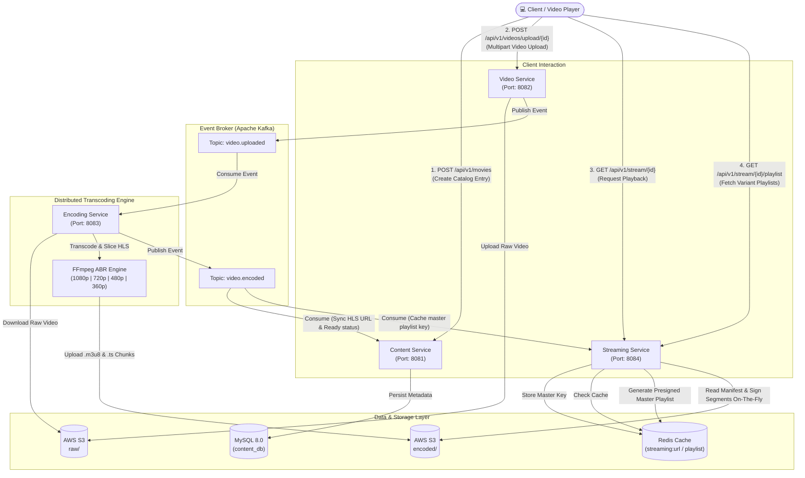

# 🎬 Netflix Microservices — Distributed Video Streaming Platform

[](https://openjdk.org/)
[](https://spring.io/projects/spring-boot)
[](https://kafka.apache.org/)
[](https://redis.io/)
[](https://aws.amazon.com/s3/)
[](https://ffmpeg.org/)
[](https://www.docker.com/)

An enterprise-grade, event-driven video streaming platform modeled after Netflix's microservices architecture. Designed for high throughput, asynchronous video processing, adaptive bitrate streaming (HLS), and secure content delivery.

---

## 🏛️ System Architecture



---

## ⚡ Core Microservices Overview

| Microservice | Port | Description | Primary Technologies |
| :--- | :---: | :--- | :--- |
| **`content-service`** | `8081` | Manages movie catalog metadata, titles, genres, and synchronizes video lifecycle states (`PENDING`, `UPLOADED`, `READY`, `FAILED`). | Spring Boot 4, Spring Data JPA, MySQL 8, Kafka Consumer |
| **`video-service`** | `8082` | Ingestion service that accepts large multipart video file uploads (up to 2GB), stores raw video in S3, and emits upload events. | Spring Boot 4, AWS SDK v2 (S3), Kafka Producer |
| **`encoding-service`** | `8083` | Asynchronous worker service that transcodes raw videos into multi-bitrate HLS streams with 10-second `.ts` segments and master playlists. | Spring Boot 4, FFmpeg, AWS SDK v2, Kafka Consumer & Producer |
| **`streaming-service`** | `8084` | Streaming gateway that generates presigned URLs, dynamically rewrites HLS manifests with signed segment links, and caches URLs in Redis. | Spring Boot 4, Redis, AWS S3 Presigner, HLS Manifest Rewriter |

---

## 🚀 Key Engineering Highlights

- **Adaptive Bitrate Streaming (HLS)**: Every video is transcoded into 4 quality tiers with automated master playlist orchestration:
  - **1080p** — 1920x1080 @ 5000 kbps (Full HD)
  - **720p** — 1280x720 @ 2800 kbps (HD)
  - **480p** — 854x480 @ 1400 kbps (SD)
  - **360p** — 640x360 @ 800 kbps (Low bandwidth / Mobile)
- **Zero Public S3 Exposure**: S3 buckets remain completely private. The streaming service reads manifests on-the-fly, presigns each individual `.ts` segment URL, and injects signed links into client responses.
- **Ultra-Fast Playback Resolution with Redis**: Master streaming URLs are cached in Redis with a 55-minute TTL, eliminating repeated database and S3 round-trips for high-traffic movies.
- **Non-Blocking Asynchronous Architecture**: Video ingestion and transcoding are completely decoupled using Apache Kafka topics.
- **Configurable & Cloud Ready**: Zero hardcoded credentials. All microservices support full configuration via environment variables with backward-compatible defaults.

---

## 📨 Kafka Topics & Event Payloads

### 1. `video.uploaded`
Published by **`video-service`** when a raw video is stored in AWS S3. Consumed by **`encoding-service`** and **`content-service`**.

```json
{
  "movieId": "3fa85f64-5717-4562-b3fc-2c963f66afa6",
  "videoKey": "raw/3fa85f64-5717-4562-b3fc-2c963f66afa6/movie_trailer.mp4",
  "bucketName": "netflix-streaming-videos",
  "originalFileName": "movie_trailer.mp4",
  "fileSizeBytes": 52428800
}
```

### 2. `video.encoded`
Published by **`encoding-service`** when FFmpeg finishes multi-bitrate HLS transcoding. Consumed by **`content-service`** (updates status to `READY`) and **`streaming-service`** (stores playlist key in Redis).

```json
{
  "movieId": "3fa85f64-5717-4562-b3fc-2c963f66afa6",
  "hlsUrl": "https://netflix-streaming-videos.s3.amazonaws.com/encoded/3fa85f64-5717-4562-b3fc-2c963f66afa6/master.m3u8",
  "masterPlaylistKey": "encoded/3fa85f64-5717-4562-b3fc-2c963f66afa6/master.m3u8",
  "success": true,
  "errorMessage": null
}
```

---

## 📡 REST API Reference

### 1. Content Service (`http://localhost:8081`)

#### Add Movie to Catalog
```bash
curl -X POST "http://localhost:8081/api/v1/movies" \
  -H "Content-Type: application/json" \
  -d '{
    "title": "Interstellar",
    "description": "A team of explorers travel through a wormhole in space in an attempt to ensure humanity survival.",
    "genre": "SCI_FI",
    "director": "Christopher Nolan",
    "cast": "Matthew McConaughey, Anne Hathaway, Jessica Chastain",
    "releaseYear": 2014,
    "rating": 8.7,
    "thumbnailUrl": "https://example.com/interstellar-poster.jpg",
    "durationMinutes": 169
  }'
```

#### List All Movies
```bash
curl -X GET "http://localhost:8081/api/v1/movies"
```

#### Get Movie Details by ID
```bash
curl -X GET "http://localhost:8081/api/v1/movies/{movieId}"
```

#### Filter Movies by Genre
```bash
# Supported Genres: ACTION, COMEDY, DRAMA, HORROR, THRILLER, ROMANCE, DOCUMENTARY, ANIMATION, SCI_FI
curl -X GET "http://localhost:8081/api/v1/movies/genre/SCI_FI"
```

#### Search Movies by Title
```bash
curl -X GET "http://localhost:8081/api/v1/movies/search?title=Interstellar"
```

---

### 2. Video Service (`http://localhost:8082`)

#### Upload Video for Movie
```bash
curl -X POST "http://localhost:8082/api/v1/videos/upload/{movieId}" \
  -F "file=@/path/to/movie.mp4"
```

---

### 3. Streaming Service (`http://localhost:8084`)

#### Get Presigned Streaming URL
```bash
curl -X GET "http://localhost:8084/api/v1/stream/{movieId}"
```

*Response:*
```json
{
  "movieId": "3fa85f64-5717-4562-b3fc-2c963f66afa6",
  "streamingUrl": "https://netflix-streaming-videos.s3.amazonaws.com/encoded/3fa85f64-5717-4562-b3fc-2c963f66afa6/master.m3u8?X-Amz-Signature=...",
  "quality": "1080p, 720p, 480p, 360p",
  "expiresInMinutes": 60
}
```

#### Fetch Signed Variant Playlist
```bash
curl -X GET "http://localhost:8084/api/v1/stream/{movieId}/playlist?path=encoded/{movieId}/1080p/playlist.m3u8"
```

---

## 🛠️ Getting Started

### Prerequisites

- **Java 25 LTS** (or Java 21+)
- **Docker & Docker Compose** (for Kafka, Zookeeper, Redis, MySQL)
- **FFmpeg**:
  - **Windows**: Download from [gyan.dev](https://www.gyan.dev/ffmpeg/builds/) and place in `C:/ffmpeg/bin/ffmpeg.exe` (or add to `PATH`).
  - **macOS**: `brew install ffmpeg`
  - **Linux**: `sudo apt update && sudo apt install -y ffmpeg`
- **AWS S3 Bucket**: An AWS S3 bucket with IAM programmatic credentials.

---

### Step 1: Clone and Configure Environment

1. Clone repository:
   ```bash
   git clone https://github.com/Manthan-Sagar/Netflix-app.git
   cd Netflix-app
   ```

2. Create your `.env` configuration file from the template:
   ```bash
   cp .env.example .env
   ```

3. Open `.env` and fill in your AWS credentials and S3 bucket:
   ```properties
   AWS_ACCESS_KEY=your_access_key
   AWS_SECRET_KEY=your_secret_key
   AWS_REGION=us-east-1
   AWS_BUCKET_NAME=your-bucket-name
   FFMPEG_PATH=ffmpeg
   TEMP_DIR=C:/temp/encoding
   ```

---

### Step 2: Launch Supporting Infrastructure

Start MySQL, Redis, Zookeeper, and Apache Kafka using Docker Compose:

```bash
docker compose up -d
```

Verify that all containers are healthy:
```bash
docker compose ps
```

| Container | Service | Host Port | Internal Port |
| :--- | :--- | :--- | :--- |
| `mysql-netflix` | MySQL 8.0 | `3307` | `3306` |
| `redis-netflix` | Redis Cache | `6379` | `6379` |
| `zookeeper` | Zookeeper | `2181` | `2181` |
| `kafka` | Apache Kafka | `9092` | `29092` |

---

### Step 3: Run Microservices

Open 4 terminal windows and launch each microservice:

#### 1. Content Service
```bash
cd content-service
./mvnw spring-boot:run
```

#### 2. Video Service
```bash
cd video-service
./mvnw spring-boot:run
```

#### 3. Encoding Service
```bash
cd encoding-service
./mvnw spring-boot:run
```

#### 4. Streaming Service
```bash
cd streaming-service
./mvnw spring-boot:run
```

---

### Step 4: Play Videos with the Built-in Test Player

1. Open [`sample-player.html`](./sample-player.html) directly in any modern web browser (Chrome, Edge, Firefox, Safari).
2. Enter your `movieId` or paste the URL generated by `http://localhost:8084/api/v1/stream/{movieId}`.
3. Click **Load & Play** to stream your video with live Adaptive Bitrate switching!

---

## 📂 Repository Layout

```text
netflix_app_manthan/
├── .env.example                     # Environment template (secrets-free)
├── .gitignore                       # Production-grade gitignore
├── docker-compose.yml               # Infrastructure (Kafka, Zookeeper, Redis, MySQL)
├── sample-player.html               # Browser HLS stream testing tool
├── README.md                        # Documentation & architecture guide
│
├── content-service/                 # Catalog & Metadata Management (Port 8081)
│   ├── pom.xml
│   └── src/main/java/com/netflix/content_service/
│       ├── controller/              # REST Endpoints (/api/v1/movies)
│       ├── model/                   # Movie, Genre, VideoStatus entities
│       ├── repository/              # Spring Data JPA repositories
│       └── service/                 # Catalog business logic & Kafka consumers
│
├── video-service/                   # Raw Video Ingestion & S3 Upload (Port 8082)
│   ├── pom.xml
│   └── src/main/java/com/netflix/video_service/
│       ├── controller/              # Upload Endpoint (/api/v1/videos/upload/{id})
│       ├── config/                  # S3 & Kafka topic creation
│       └── service/                 # S3 upload & Kafka event publication
│
├── encoding-service/                # Distributed HLS Transcoding Engine (Port 8083)
│   ├── pom.xml
│   └── src/main/java/com/netflix/encoding_service/
│       ├── config/                  # S3 client configuration
│       ├── event/                   # VideoUploadedEvent, VideoEncodedEvent
│       └── service/                 # FFmpeg multi-tier transcoding pipeline
│
└── streaming-service/               # HLS Streaming Gateway & Manifest Signer (Port 8084)
    ├── pom.xml
    └── src/main/java/com/netflix/streaming_service/
        ├── controller/              # Streaming Endpoints (/api/v1/stream/{id})
        ├── config/                  # Redis & CORS configuration
        └── service/                 # Presigned URL generation & segment rewrite
```

---

## 🔒 Security Best Practices

- **Never commit `.env`**: `.gitignore` is strictly configured to ignore all `.env` files except `.env.example`.
- **Pre-signed Access**: Media segments are signed dynamically with short-lived expiration tokens, preventing hotlinking or unauthorized sharing.
- **CORS Configured**: Secure cross-origin resource sharing policy restricts unauthorized domain manipulation.

---

## 👨‍💻 Author

Developed by **Manthan Sagar**  
GitHub: [@Manthan-Sagar](https://github.com/Manthan-Sagar)
